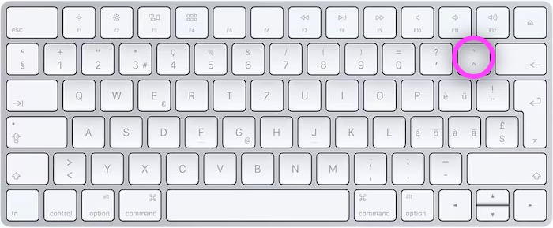

Pour citer plus facilement du code, on utilise du texte à espacement fixe (`monospaced`).

## Une section de texte monospace

On obtient cela `pour une section` dans un texte, en l'encadrant avec des \`backtick\`. Sur clavier suisse, il se trouve en haut à droite au-dessus de l'accent circonflexe (`^`).



## Un bloc de code

Pour obtenir un bloc de code "monospaced" sur une ou plusieurs lignes, il existe deux méthodes.

Premièrement, ajouter un retrait de quatre espaces au début de chaque ligne produit ce résultat:

    <html>
    <h1>Exemple de code<h1>
    </html>

Deuxième méthode, ajouter **trois backticks** en début et en fin du bloc :

    ```
    <h1>Exemple de code<h1>
    ```

Résultat:

```
<h1>Exemple de code<h1>
```

Encore mieux: on peut activer la coloration de syntaxe, en précisant après les trois premiers backticks le nom du langage (html, css, javascript...):


    ```html
    <h1>Exemple de code<h1>
    ```

Résultat:

```html
<h1>Exemple de code<h1>
```

## Le caractère "Escape Caracter"

Si l'on veut éviter le formatage markdown, pour pouvoir utiliser les caractères spéciaux tels que les \_ ou les \*, vous devez les précéder par un "backslash" (`\`), obtenu avec `maj+option+7`)`.