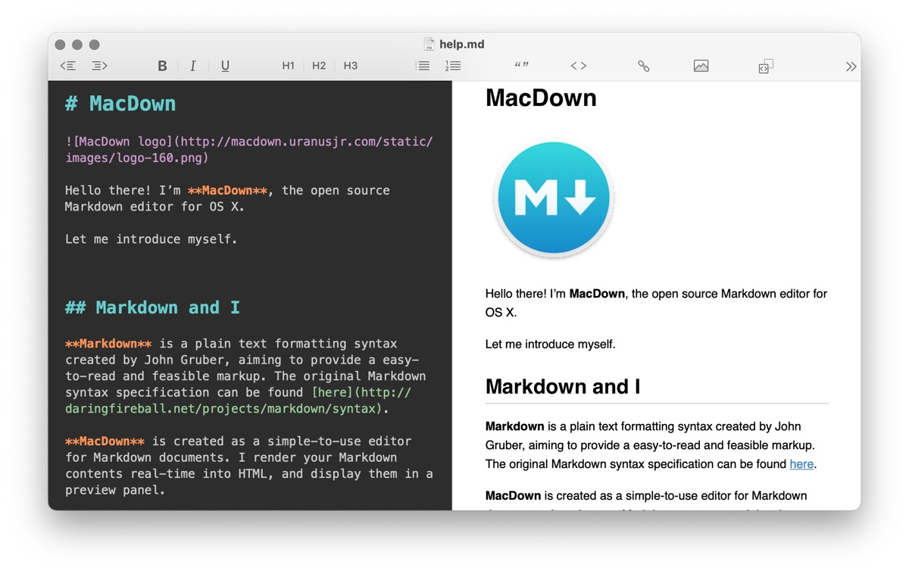

## Editeurs

Editeurs de texte conçus pour écrire en MarkDown: 

* [MarkText](https://github.com/marktext/marktext) (gratuit et open-source)
* [MacDown](https://macdown.uranusjr.com/) (gratuit et open-source)
* [ByWord](https://bywordapp.com/) - commercial
* [Typora](https://typora.io/) - commercial
* [iA Writer](https://ia.net/writer/) - commercial

MacDown, un éditeur affichant d'un côté le code MarkDown, de l'autre le résultat produit:

MarkText, un éditeur de texte simple et élégant :

### Le Markdown dans VS Code

Certains éditeurs de code, tels que *Visual Studio Code*, offrent un bon support pour les fichiers Markdown. 

Dans VS Code, un fichier dont le nom se termine par `.md` sera reconnu comme un fichier Markdown. VS Code permet par exemple de glisser-déposer un document ou une image pour produire le code voulu.

Avec le raccourci `⇧⌘V` on active une prévisualisation du document.

Avec le raccourci `⌘K V`, on active une vue côte-à-côte du code et du résultat.

[Cette page donne tous les détails](https://code.visualstudio.com/docs/languages/markdown) sur le support de Markdown dans VS Code.

### Gestionnaires de notes

Certains logiciels proposent davantage qu'un éditeur, mais un véritable environnement de prise de notes et de documentation ("*note-taking and knowledge management*"):

* [Zettlr](https://www.zettlr.com/) (gratuit et open-source)
* [Obsidian](https://obsidian.md/) (application freemium)
* [Logseq](https://logseq.com/) (gratuit et open-source)

Zettlr, un éditeur avec de nombreuses fonctionnalités d'aide à l'organisation :

