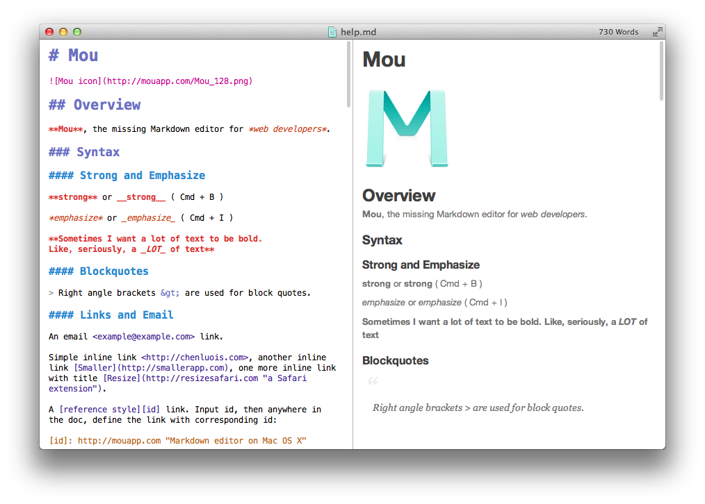

## Ressources

Editeurs de texte conçu pour le MarkDown: 

* *[ByWord](https://bywordapp.com/)*
* *[iA Writer](https://ia.net/writer/)*
* *[MacDown](https://macdown.uranusjr.com/)* (gratuit et open-source)
* [Typora](https://typora.io/)
* [Mark Text](https://marktext.app/)

Un éditeur de text affichant d'un côté le code MarkDown, de l'autre le résultat produit:

Vous avez aussi un très bon support dans ces éditeurs de code: 

* *Atom*
* *Visual Studio Code*

* [Article Wikipédia](https://fr.wikipedia.org/wiki/Markdown)
* [définition de la syntaxe MarkDown](https://daringfireball.net/projects/markdown/syntax) par John Gruber
* [Un tutoriel sur OpenClassrooms](https://openclassrooms.com/courses/redigez-en-markdown)
* [MarkDown Quick Reference](http://en.support.wordpress.com/markdown-quick-reference/) (anglais)

### Approfondissement

- Mpondo-Dicka Patrick, « [Le Markdown, une praxis énonciative du numérique](http://dx.doi.org/10.25965/interfaces-numeriques.3915) », *Interfaces numériques*, 2019, vol. 8, n°2.
